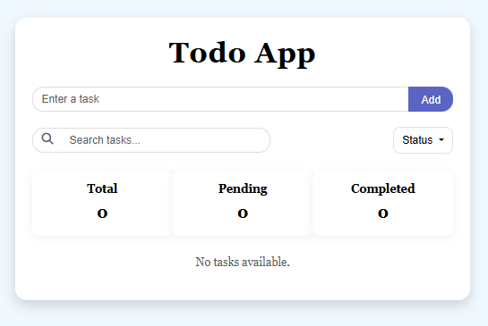
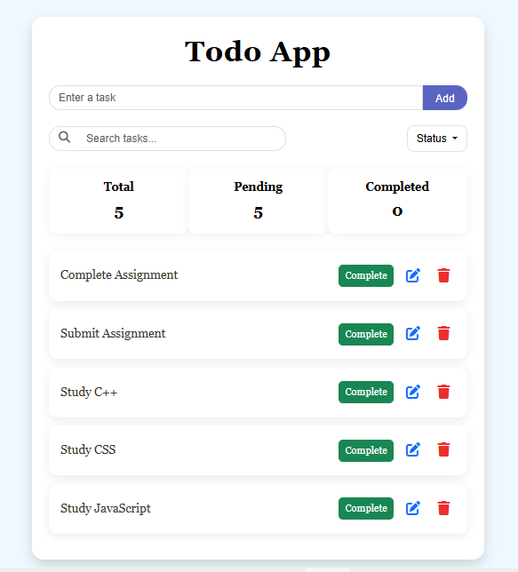
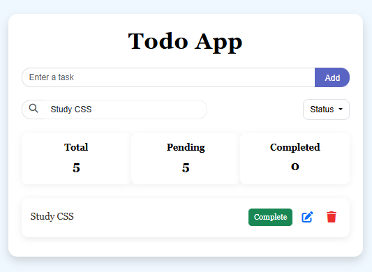
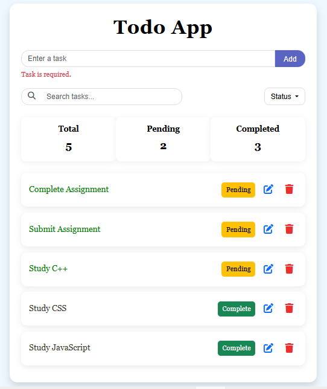
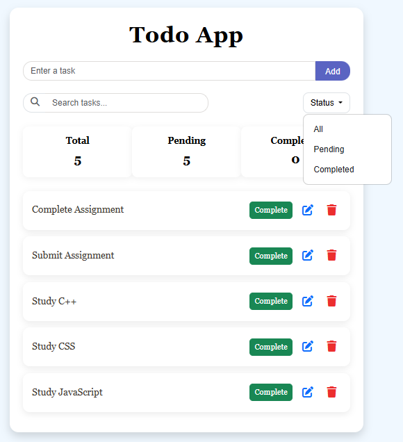
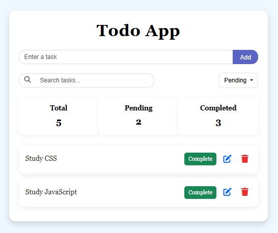
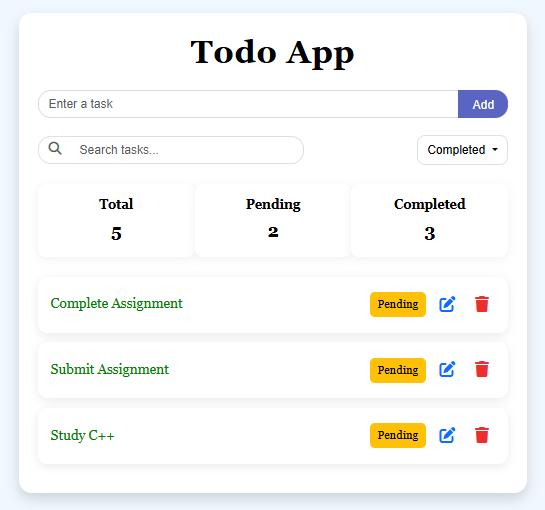
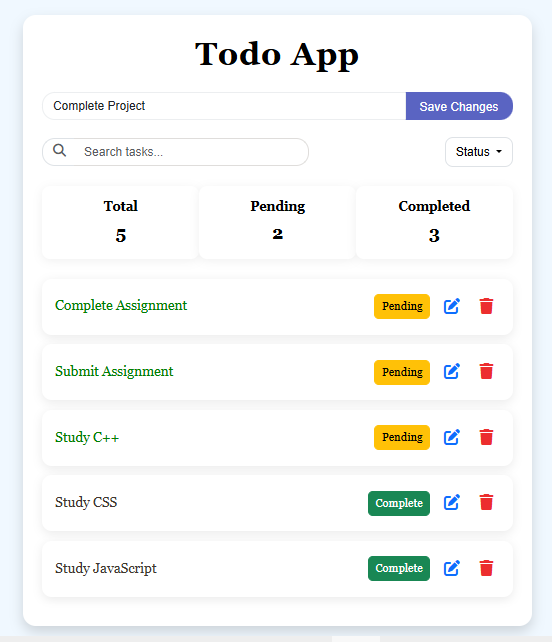
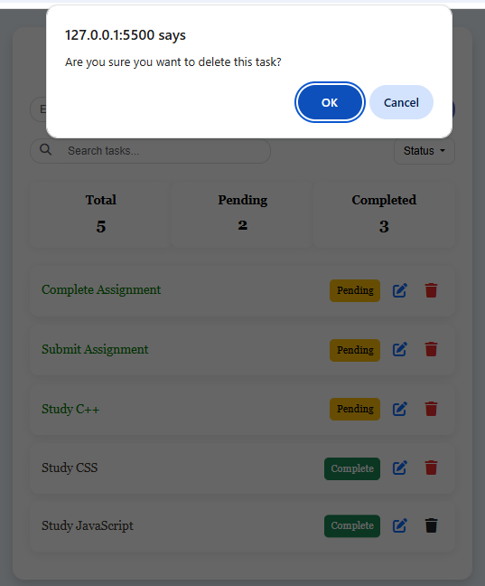

## TODO APP

A responsive and user-friendly To-Do application built using HTML, CSS, Bootstrap, and Vanilla JavaScript.
The application allows users to add, edit, delete, search, and manage their daily tasks easily.

## 🔗 Live Demo

https://todo-app-delta-tawny-60.vercel.app/

## 📸 Screenshots

<table>
   <tr>
    <td align="center"><b>Main Interface</b> </td>
    <td align="center"><b>Tasks Added</b> </td>
  </tr>
   <tr>
    <td align="center"><b>Search Tasks</b> </td>
    <td align="center"><b>Input Validation</b> </td>
  </tr>
   <tr>
    <td align="center"><b>Status Filter</b> </td>
    <td align="center"><b>Pending Tasks</b> </td>
  </tr>
   <tr>
    <td align="center"><b>Completed Tasks</b> </td>
    <td align="center"><b>Edit Tasks</b> </td>
  </tr>
   <tr>
    <td align="center"><b>Delete Tasks</b> </td>
  </tr>
</table>

## ✨Features

* Add new tasks
* Edit existing tasks
* Delete tasks
* Mark tasks as completed or pending
* Show completed tasks with line-through styling
* Search tasks by title
* Filter tasks by:
  - All
  - Pending
  - Completed
* Show total, pending, and completed task counts
* Store tasks in LocalStorage
* Keep tasks available after page refresh
* Basic input validation
* Show an empty-state message when there are no tasks
* Responsive design using Bootstrap
* Separate HTML, CSS, and JavaScript files

## 🛠️Technologies Used

* HTML5
* CSS3
* Bootstrap
* Vanilla JavaScript
* LocalStorage

## 👩🏻‍💻Author

Laiba Fatima
